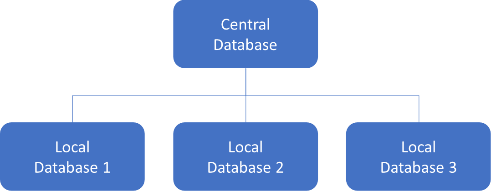

# Welcome

This playground as the final goal to guide you through the usage of databases with Spring, from a simple case with one 
database to a more complex example with multiple database. In my day job, I had to deal with this complex situation and 
it took me some times to figure it out. I didn't find much example to guide me through. 

In this job context, we have to deal with multiple databases, few local databases, that are the same, but with 
localized information, and one central database is used to store global parameters or where on which local database 
go to find specific data. We can represent this architecture through this scheme:

In most cases, we need to connect to the central database to know on which local database we need to fetch data. 
Thus, we mostly work with 2 databases in the same thread.

If you've read articles or Spring documentation, you probably know how to play with a database, even two, and how easy it is. 
But, what's not easy to find or understand is to plug our Spring projects upon multiple databases, for the same type of data.

Via this playground, we'll go through multiple steps, with:

- Databases configuration : Initialize our databases that will be used through all the other steps
- Solo database : How to configure and use a unique database
- Two databases : How to configure and use multiple datasources for different entities / packages
- Database Sharding : How to use different databases depending on the context for the same entities / packages
- Answering our use case by combining the previous steps

You can jump from chapter to another, depending on what you already know and what you're looking for.

# Final word

The source code is on [GitHub](https://github.com/romainbsl/techio-database-sharding), please feel free to come up with proposals to improve it.
